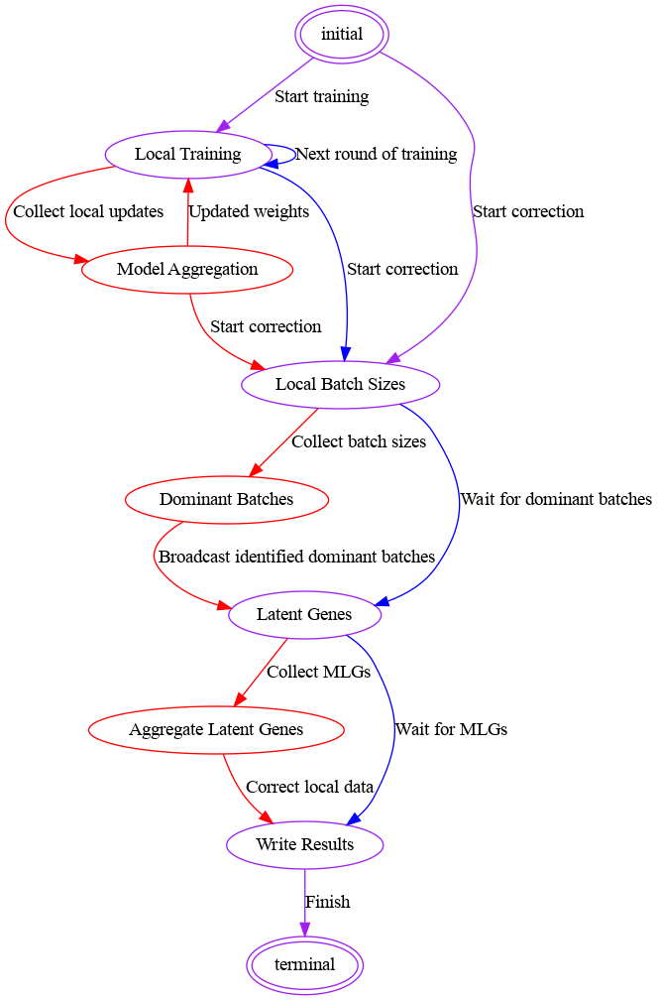

# FeatureCloud FedscGen app

## Introduction

The FedscGen is a federated application designed for the FeatureCloud platform, enabling collaborative training and correction workflows for single-cell genomic data analysis while preserving data privacy. It facilitates distributed machine learning without sharing raw data among participants.
Installation and Requirements

Before running FedScGen, ensure that you have installed Python 3.x and the FeatureCloud app library. You may also need additional libraries specific to federated learning and data handling; please refer to our installation guide for detailed steps and requirements.
Configuration

The application can be configured using the provided config.yaml file. Here is an overview of the configuration options available:

```yaml
fedscgen:
  workflow: "train" # Set to 'train' for training the model and 'correction' for data correction.
  data:
    adata: raw.h5ad # The path to the input data file in .h5ad format.
    batch_key: batch # Key for batch information in the input data.
    cell_key: cell_type # Key for cell type information in the input data.

  model:
    init_model: None # Path to the initial model; set to None to start from scratch.
    ref_model: model.pth # Path to the reference model used for correction.
    hidden_layer_sizes: "800,800" # The sizes of hidden layers in the model, comma-separated.
    z_dimension: 10 # The dimensionality of the latent space.

  train:
    lr: 0.01 # Learning rate for the training.
    epoch: 3 # Number of epochs for each training round.
    batch_size: 32 # Size of the batches for training.
    early_stopping: # Configuration for early stopping.
      early_stopping_metric: "val_loss" # Metric used for early stopping.
      threshold: 0 # Threshold for the early stopping metric.
      reduce_lr: True # Whether to reduce learning rate on plateau.
      lr_patience: 13 # Number of epochs to wait before reducing lr.
      lr_factor: 0.1 # Factor by which the lr will be reduced.
    n_rounds: 2 # Number of federated learning rounds.
```

Each option is crucial for customizing the behavior of the FedScGen app. Ensure you set these options in accordance with your data and desired model performance.
Usage

To run the FedScGen application with sample data:
Ensure you have the sample data in .h5ad format and a reference model if required.
Configure your config.yaml file according to your needs.
Execute the FedScGen application through the FeatureCloud platform, following the platform's guidelines for running apps.

## State Diagram and Workflow

The FedscGen application workflow is represented by a state diagram, indicating the sequence of states that the application may enter during its execution. The following state diagram illustrates the various stages of the application's lifecycle:



State Diagram Legend:

    Red Arrows: Transitions triggered by the coordinator.
    Blue Arrows: Transitions initiated by participants.
    Purple Arrows: Transitions relevant to both coordinator and participants.

### State Descriptions

Here we describe each state, aligned with the states.py script:

#### Training Workflow:
* initial State: Sets up the necessary environment and variables to begin the federated process.
* Local Training State: Participants train their local models using their data.
* Model Aggregation State: Coordinator aggregates the local models to improve the global model.
* Local Batch Sizes: All clients report their batch sizes for all locally available cell types to the coordinator.
* Dominant Batches: Coordinator determines the dominant batch size among all clients for each cell type.
* Latent Genes: All clients share the mean latent genes for the cell types with dominant batch.
* Aggregated Latent Genes: Coordinator aggregates the latent genes into global mean latent genes.
* Write results: Clients correct their data using the global mean latent genes and the trained model.

#### Correction Workflow:
* initial State: Sets up the necessary environment and variables to begin the correction process.
* Dominant Batches: Coordinator determines the dominant batch size among all clients for each cell type.
* Latent Genes: All clients share the mean latent genes for the cell types with dominant batch.
* Aggregated Latent Genes: Coordinator aggregates the latent genes into global mean latent genes.
* Write results: Clients correct their data using the global mean latent genes and the trained model.
 

The transitions between these states are handled automatically by the FedscGen application based on the conditions met during the execution.


## Output
After the application completes its execution, the results are available in FeatureCloud platform which includes the following items:

* Corrected data: The corrected data in `H5Ad` format.
* Trained model: The trained model in `pth` format.
* Mean latent genes: The mean latent genes for each cell type in `csv` format.

Using the model and mean latent genes, the participants can correct their data locally.

## Troubleshooting and Support

If you encounter any issues, first ensure that your config.yaml is properly formatted and that all paths and keys are correct. For additional support, contact mohammad.bakhtiari@uni-hamburg.de.