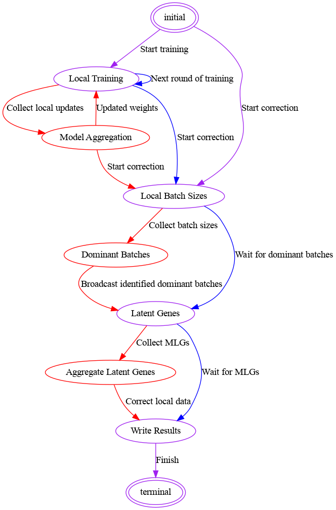

# FeatureCloud FedscGen app

FedscGen is a federated application developed for the [FeatureCloud](featurecloud.ai) platform. It enables privacy-preserving, collaborative training and correction workflows for single-cell genomic data analysis. FedscGen allows distributed machine learning without sharing raw data between participants.

📄 The preprint "FedscGen: privacy-aware federated batch effect correction of single-cell RNA sequencing data" is available on 🔗 [ResearchSquare]( https://www.researchsquare.com/article/rs-4807285/v1).

💻 To reproduce the results, visit the official GitHub repository: 🔗 [GitHub – FedscGen](https://github.com/Mohammad-Bakhtiari/FedscGen)


<a href="https://featurecloud.ai/app/fedscgen" target="_blank">  </a> The FedscGen app is publicly available in the FeatureCloud App Store for real-world federated workflows: 🔗 [FeatureCloud App Store – FedscGen](https://featurecloud.ai/app/fedscgen)


## 📦 Installation and Requirements

Before running FedscGen, ensure you have the following installed:

  * Python 3.7 or higher
  * FeatureCloud CLI

For more information on the requirements, please refer to the 🔗 [FeatureCloud Medium Stories](https://medium.com/developing-federated-applications-in-featurecloud)

## ⚙️ Configuration

Configure the application using the provided `config.yaml` file. Below is an overview of the available options:
```yaml
fedscgen:
  workflow: "train" # Set to 'train' for training the model and 'correction' for data correction.
  data:
    adata: raw.h5ad # The path to the input data file in .h5ad format.
    batch_key: batch # Key for batch information in the input data.
    cell_key: cell_type # Key for cell type information in the input data.
  smpc: True # Set to True for secure multi-party computation.
  n_rounds: 2 # Number of rounds for federated learning.
  model:
    init_model: None # Path to the initial model; set to None to start from scratch.
    ref_model: model.pth # Path to the reference model used for correction.
    hidden_layer_sizes: "800,800" # The sizes of hidden layers in the model, comma-separated.
    z_dimension: 10 # The dimensionality of the latent space.

  train:
    lr: 0.01 # Learning rate for the training.
    n_epochs: 3 # Number of epochs for each training round.
    batch_size: 32 # Size of the batches for training.
    
```
## 🧪 Sample Data and Workflows
We provided a sample data to run FedscGen in [FeatureCloud testbed](https://featurecloud.ai/development/test) with two clients.
The sample data contains Mouse Haematopoietic Stem and Progenitor Cells (MHSPC) dataset with two batches: 
* [`SMART-seq2`](data/c1/MHSPC.h5ad): 1920 cells
* [`MARS-seq`](data/c2/MHSPC.h5ad): 2729
Also the entire dataset is available in the [`MouseHematopoieticStemProgenitorCells.h5ad`](data/MouseHematopoieticStemProgenitorCells.h5ad) file.
```shell
data/
├── c1
│   └── MHSPC.h5ad
├── c2
│   └── MHSPC.h5ad
├── generic_correction_wf
│   ├── config.yaml
│   └── trained model
│       ├── attr.pkl
│       ├── model_params.pt
│       └── var_names.csv
├── generic_train_wf
│   ├── config.yaml
│   └── model
│       ├── attr.pkl
│       ├── model_params.pt
│       └── var_names.csv
└── MouseHematopoieticStemProgenitorCells.h5ad

```
### 🧠 Train Workflow
The sample data includes a dedicated generic configuration for FedscGen train workflow.
The [configuration file](data/generic_train_wf/config.yaml) trained the FedscGen model for two communication rounds and one local epoch using SMPC.
At the last state, the app outputs the trined model and mean latent genes beside the corrected local data. The trained model could be used as a reference model for the correction workflow.

### 🧹 Correction workflow
Similar to train workflow, the sample data includes a dedicated generic configuration for FedscGen correction workflow.
The [configuration file](data/generic_correction_wf/config.yaml) corrects the local data using the trained model and th e mean latent genes. The app outputs the corrected data and the mean latent genes for each cell type.
Although the correction workflow can support new datasets to update mean latent genes, the provided sample does not include additional studies. The correction only uses the existing model and dominant batches.


### 🚀 Usage

To run FedscGen with sample data:
* Ensure your data is in .h5ad format.
* Update the config.yaml file as needed.
* Run the app using the FeatureCloud platform by following the app execution steps defined [here](https://medium.com/developing-federated-applications-in-featurecloud/run-an-app-in-fc-test-bed-b4b0ecae08b0).


## 🧭 State Diagram

FedscGen's lifecycle is driven by a state machine. The state diagram below outlines key stages:



Legend

    🔴 Red: Coordinator states and Coordinator-triggered transitions

    🔵 Blue: Participant states and Participant-triggered transitions

    🟣 Purple: Shared states and transitions

🐧 Note: the states and transitiuons could be dedicated to one of the roles or both. For more information, please check [FeatureCloud roles](https://github.com/FeatureCloud/FeatureCloud/tree/master/FeatureCloud/app/engine#roles).

#### 🧪 Training Workflow States

* initial: Environment and variables setup
* Local Training: Clients train models on local data
* Model Aggregation: Coordinator aggregates client models
* Local Batch Sizes: Clients report cell-type-wise batch sizes
* Dominant Batches: Coordinator identifies dominant batch per cell type
* Latent Genes: Clients share mean latent genes
* Aggregated Latent Genes: Coordinator computes global latent means
* Write Results: Clients correct data using global means and the model

#### 🧹 Correction Workflow States
Same as training workflow, but without the local training and model aggregation states. The states are as follows:
* initial: Environment setup for correction
* Dominant Batches
* Latent Genes
* Aggregated Latent Genes
* Write Results
 
Transitions are handled automatically by the application.


## 📤 Output

Upon completion, FeatureCloud provides:

    ✅ Corrected data in .h5ad format

    ✅ Trained model in .pth format

    ✅ Mean latent genes in .csv format

These outputs allow clients to locally apply corrections using shared parameters.


## 🛠 Running FedscGen on FeatureCloud

### Prerequisites

Install FeatureCloud CLI:
```shell
pip install featurecloud
```

Start the controller:
```shell
featurecloud controller start --data-dir <path_to_data_dir>
```
⚠️ Each client should have its own folder inside the data directory. For demo data, copy the provided data/ folder directly.

🐧 Note: FeatureCloud controller may not work while connected to a VPN on Linux due to Docker limitations.

Optional: [Create an account](https://featurecloud.ai/account?p=signup) on FeatureCloud to access full functionality and run real-world federated workflows.


### 🧪 Testing Mode (Local Simulation)

FeatureCloud's testbed allows local simulation of federated scenarios:

Download the FedscGen app image:
```shell

docker pull featurecloud/fedscgen:latest
```

🔄 Federated Workflows

To run FedscGen in a real-world federated setting across multiple institutions:

1. Create a Project
    Log in to FeatureCloud and [create a new project](https://featurecloud.ai/projects).
2. Add the FedscGen App
    You can:
        * Manually search for and add the [FedscGen app](https://featurecloud.ai/app/fedscgen) from the app store, or
        * Use the predefined [FedscGen workflow template](https://featurecloud.ai/workflow/51) to get started quickly. 
3. Assign Clients 
   Invite collaborators or link local client instances to participate in the federated workflow. 
4. Submit Data 
   Each client can upload data independently, or reference their local data paths as configured in the FeatureCloud client setup.
5. Run the Workflow
   Once all clients are connected and the app is configured, start the workflow to begin federated training or correction.

📝 For a detailed walkthrough with visuals, check out this helpful guide:
👉 [Running Federated Machine Learning Workflows in FeatureCloud (Medium)](https://medium.com/developing-federated-applications-in-featurecloud/running-federated-machine-learning-workflows-in-featurecloud-952f90ece166)


🧰 Troubleshooting and Support

If you encounter issues:

* Check that config.yaml is correctly formatted
* Verify all file paths and keys are valid

📬 Contact: mohammad.bakhtiari@uni-hamburg.de